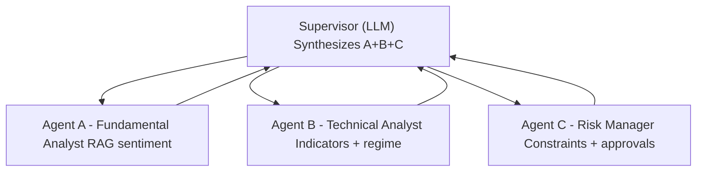

# qfin-agent
RAG-based multi-agent trading research system where specialized analysts debate and a supervisor returns a final Buy/Sell/Hold decision.

## Architecture


## Why LangGraph
LangGraph was selected instead of CrewAI because the workflow needs explicit typed state transitions (`A -> B -> C -> Supervisor`), deterministic node composition, and easier testability of each node in isolation.

## Features
- Typed inter-agent contracts via Pydantic (`src/qfin_agent/models/schemas.py`)
- Agent B technical stack: SMA/EMA, RSI, MACD, Bollinger Bands, ATR
- Modular RAG pipeline: ingest -> chunk -> embed -> retrieve (FAISS backend)
- Agent A fundamental sentiment from retrieved evidence and LLM summarization
- Agent C policy-based risk manager with configurable constraints
- LangGraph supervisor orchestration with structured final recommendation
- Async I/O for market/news fetching and model calls

## Tech Stack
- Python 3.12+
- `uv` for dependency management
- LangGraph + LangChain
- OpenAI (`gpt-5.1` for agents, `gpt-5.2` for supervisor)
- FAISS vector store
- yfinance for OHLCV data
- RSS/Finnhub free news feeds for fundamentals
- pytest + pytest-asyncio for tests

## Project Layout
```text
qfin-agent/
├── src/qfin_agent/
│   ├── agents/
│   │   ├── fundamental.py
│   │   ├── technical.py
│   │   └── risk_manager.py
│   ├── supervisor/supervisor.py
│   ├── rag/
│   │   ├── ingest.py
│   │   ├── embeddings.py
│   │   └── retriever.py
│   ├── data/market_data.py
│   ├── models/schemas.py
│   └── config.py
├── tests/
├── notebooks/demo.ipynb
├── .env.example
└── README.md
```

## Setup
1. Install dependencies:
```bash
uv sync
```
2. Configure environment variables:
```bash
cp .env.example .env
# fill OPENAI_API_KEY and optional FINNHUB_API_KEY
```
3. Run tests:
```bash
uv run pytest
```

## Usage
CLI:
```bash
uv run qfin-agent AAPL --period 6mo --interval 1d
```

Notebook:
- Open `notebooks/demo.ipynb` and run the cells to execute the same workflow interactively.

## Example Output
```json
{
  "ticker": "AAPL",
  "final_recommendation": "hold",
  "confidence": 0.67,
  "rationale": "Fundamental sentiment is mildly positive, technical trend is bullish, but risk manager flagged exposure constraints.",
  "fundamental": {
    "sentiment_score": 0.24,
    "summary": "Recent coverage shows resilient earnings quality with mixed macro headwinds."
  },
  "technical": {
    "trend": "bullish",
    "momentum": "positive",
    "volatility_regime": "normal",
    "confidence": 0.75
  },
  "risk": {
    "decision": "flag",
    "recommendation": "hold",
    "violations": [
      {
        "rule": "max_gross_exposure",
        "message": "Projected gross exposure would exceed the configured limit."
      }
    ]
  }
}
```

## Future Improvements
- Live execution adapter (paper trading broker integration)
- Historical backtesting harness for agent/supervisor policies
- More specialist agents (macro, options flow, valuation)
- Persistent vector index and scheduled re-ingestion jobs
